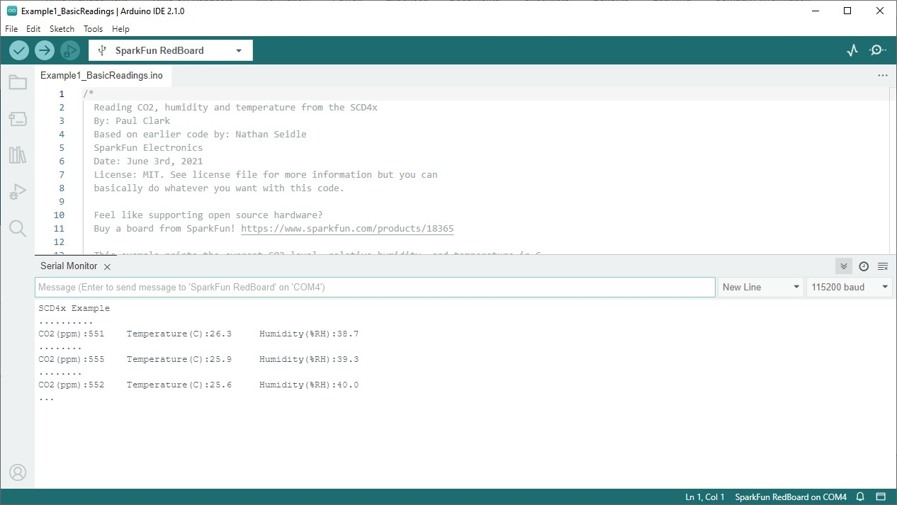

The SparkFun SCD4X Arduino Library includes several examples to start receiving CO<sub>2</sub> concentration, temperature and humidity data from the SCD4X. Let's take a closer look at a few of the examples included with the library.

## Example 1 - Basic Readings

The first example in the library demonstrates how to initialize the SCD4X on the I<sup>2</sup>C bus to poll data from the sensor using periodic measurements every five seconds. Open the example by navigating to **File** > **Examples** > **SparkFun SCD4x Arduino Library** > **Example1_BasicReadings**. Alternatively, you can copy the code below into a blank Arduino sketch:

??? "Example 1 Arduino Code"
	```
	--8<-- "https://raw.githubusercontent.com/sparkfun/SparkFun_SCD4x_Arduino_Library/main/examples/Example1_BasicReadings/Example1_BasicReadings.ino"
	```

Select your Board/Port and click the "Upload" button. Once the code finishes uploading, open up a [Serial Monitor](https://learn.sparkfun.com/tutorials/terminal-basics) and check the output. You should see CO<sub>2</sub>, temperature and humidity data print out every 5 seconds:

<figure markdown>
[{ width="600"}](./assets/images/SCD4x_Example_1_Output.jpg "Click to enlarge")
</figure>

## Example 2 - Low Power Readings

The second example demonstrates how to configure the SCD4X to disable periodic measurements and enable low-power mode. This sets the SCD4x to take measurements every 30 seconds. Open the example in Arduino or copy the code below into a blank sketch:

??? "Example 2 Arduino Code"
    ```
	--8<-- "https://raw.githubusercontent.com/sparkfun/SparkFun_SCD4x_Arduino_Library/main/examples/Example2_LowPowerReadings/Example2_LowPowerReadings.ino"
	```
After uploading, open the serial monitor and you should see data print out every second though it should remain static for the 30 seconds between measurements.

## Example 6 - Signal Compensation

Example six shows how to input custom compensation values for temperature, altitude and ambient pressure. The code stops periodic measurements while the values are stored. These values are stored in the sensor's RAM by default but can be stored in EEPROM. When stored in RAM, the values reset if <code>reInit</code> is called or on a power cycle. After the settings are stored, the code reinitializes periodic measurements and prints out data for CO<sub>2</sub>, temperature, and humidity.

??? "Example 6 Arduino Code"
    ```
	--8<-- "https://raw.githubusercontent.com/sparkfun/SparkFun_SCD4x_Arduino_Library/main/examples/Example6_SignalCompensation/Example6_SignalCompensation.ino"
	```

## Example 8 - SCD41 Single Shot

The eighth example demonstrates how to configure the SCD41 to operate in Single-Shot mode for maximum power efficiency. The code disables periodic measurements and enables single-shot measurements with the <code>measureSingleShot</code> function. The main loop waits for fresh data from the SCD41 and then prints out CO<sub>2</sub>, temperature, and humidity data whenever it is available.

??? "Example 6 Arduino Code"
    ```
	--8<-- "https://raw.githubusercontent.com/sparkfun/SparkFun_SCD4x_Arduino_Library/main/examples/Example8_SCD41SingleShot/Example8_SCD41SingleShot.ino"
	```

