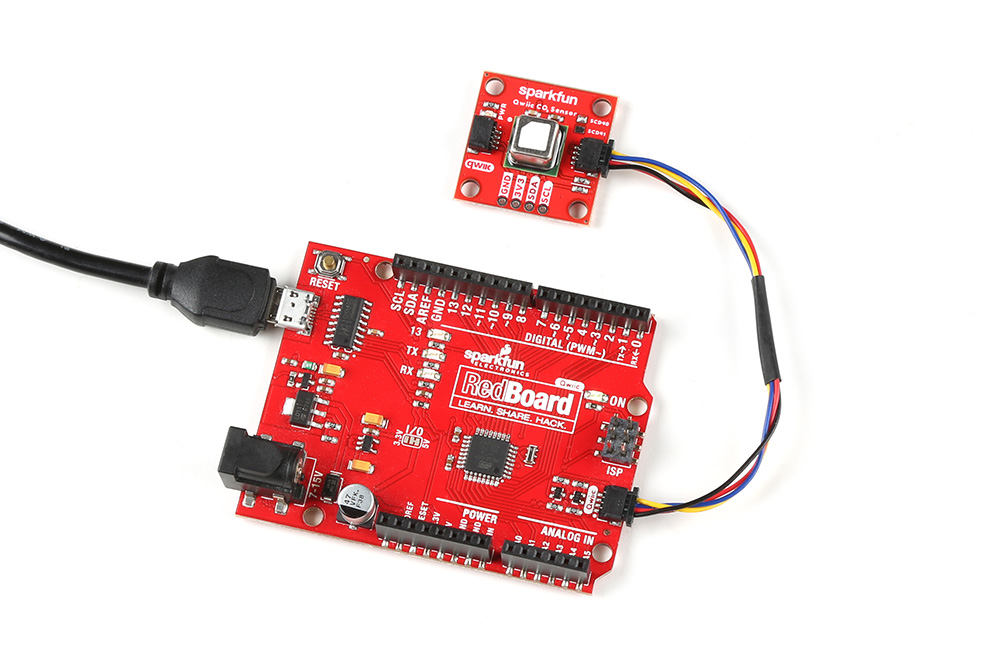

Now that we're familiar with the SCD4X sensors and these breakouts, it's time to assemble it into a circuit.

## Qwiic Assembly

SparkFun's Qwiic system makes assembling a circuit a breeze. Simply plug the breakout into your chosen microcontroller with a Qwiic cable. After assembling your circuit, it should look similar to the photo below:

<figure markdown>
[{ width="400"}](./assets/images/Qwiic_SCD4x-Assembly.jpg "Click to enlarge")
<figcaption markdown>SparkFun CO2 Humidity and Temperature Sensor - SCD40 (Qwiic) plugged into the RedBoard Qwiic</figcaption>
</figure>

Reminder, for ideal results, make sure to fully calibrate the SCD4X by taking continuous measurements for one hour every day for seven days.

## Soldered Assembly

Those who prefer a traditional soldered assembly should solder wires or header pins to the PTH header on the side of the board. If you're not familiar with through-hole soldering or would like a refresher, take a look at our Through-Hole Soldering Tutorial:

-   <a href="https://learn.sparkfun.com/tutorials/5">
    <figure markdown>
    
    </figure>
    </a>
    <a href="https://learn.sparkfun.com/tutorials/5">**How to Solder: Through-Hole Soldering**
    </a>

