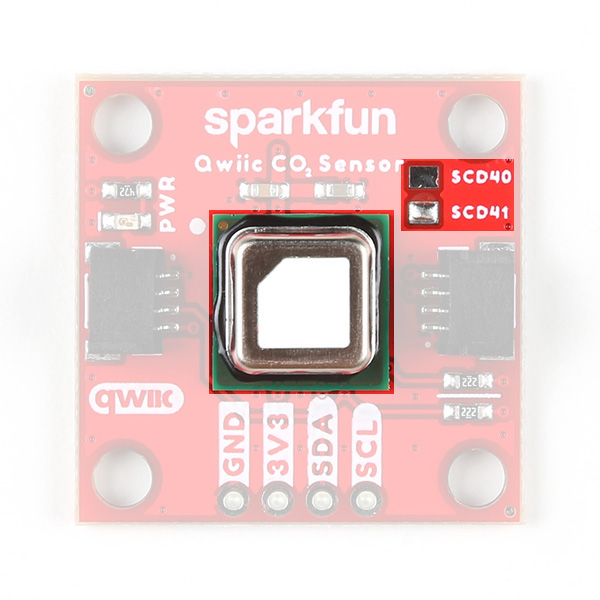
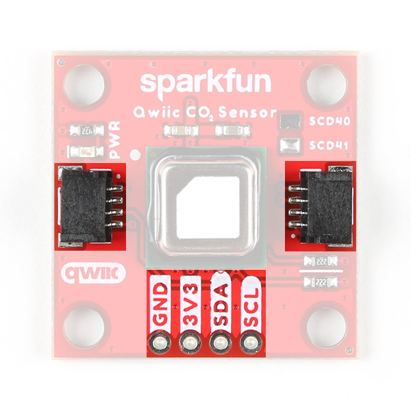
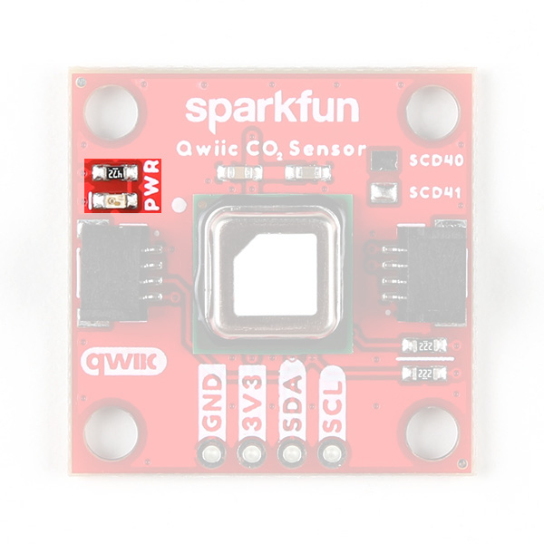
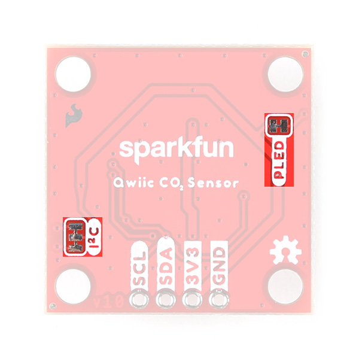
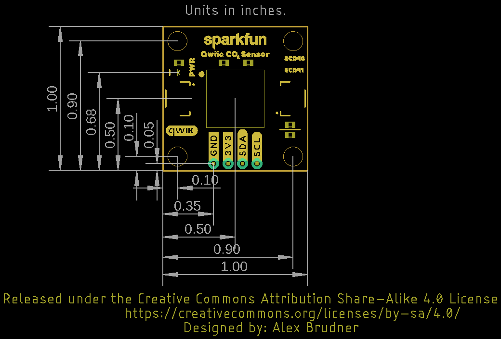

Let's take a closer look at the SCD4X sensors and hardware on these sensor breakouts.

## SCD40 and SCD41 CO2 Sensors

The SCD4x CO2 sensors use Sensirion's PASense&trade;, a photoacoustic measurement system, to accurately measure CO2 concentration using a combination of a narrow band of IR light and a microphone. The sensors also have a built-in humidity and temperatuer sensor using Sensirion's CMOSens&trade; technology to provide environmental data and compensate for environmental conditions in CO2 measurement. For a detailed overview of the SCD4X sensors, refer to the [datasheet](./assets/component_documentation/Sensirion_CO2_Sensors_SCD4x_Datasheet.pdf).

<figure markdown>
[{ width="400"}](./assets/images/Qwiic_SCD4x-Sensor.jpg "Click to enlarge")
<figcaption markdown>Note: The PCB design is shared between the SCD40 and SCD41 and the version is indicated by the solder pad above the sensor.</figcaption>
</figure>

Now you may be curious as to just what photoacoustic measuring actually is. Photoacoustic measuring uses light (photo) and sound/vibrations (acoustic) in tandem to measure the the photoacoustic effect when energy is absorbed by particles (in the case of these sensors, CO2 molecules). The SCD4X has an IR emitter with a filter to shine a specific IR light into the sensing area. CO2 molecules inside the sensing area absorb energy from the emitted IR light and vibrate. The microphone inside the sensing area picks up this acoustic vibration and then this data is processed to report CO2 concentration. This is just a quick and basic explanation of the photoacoustic process used in these sensors. For detailed information on Sensirion's PASens and CMOSens technology, refer to their [technology page](https://sensirion.com/products/technology).

The SCD4X sensors accept a supply voltage between <b>2.4V</b> to <b>5.5V</b> though they run on <b>3.3V</b> in standard Qwiic circuits. The sensors draw max of <b>205mA@3.3V</b> with an average draw of <b>18mA@3.3V</b> with periodic measurements in normal mode (<b>3.5mA@3.3V</b> in low power mode). While in Single Shot mode and taking one measurement every five minutes, the SCD41 draws only <b>0.5mA@3.3V</b>. 

Both sensors have identical operating characteristics outside of their ideal measurement ranges, measurement accuracy, and feature set. The SCD40's ideal measurement range is 400ppm to 2,000pm with an accuracy of &plusmn;50ppm + 5% of the reading and the SCD41 has an ideal measurement range of 400ppm to 5,000ppm with an accuracy of &plusmn;40ppm + 5% of the reading. The SCD41 also includes a single-shot mode for low power applications. The table below outlines the rest of the SCD4X's sensing parameters: 

<table>
    <tr>
        <th>Parameter</th>
        <th>Units</th>
        <th>Min</th>
        <th>Typ</th>
        <th>Max</th>
        <th>Notes</th>
    </tr>
    <tr>
        <td>CO2 Output Range</td>
        <td>ppm</td>
        <td>0</td>
        <td>-</td>
        <td>40,000</td>
        <td></td>
    </tr>
    <tr>
        <td rowspan="2" style="vertical align middle">CO2 Measurement Accuracy</td>
        <td rowspan="2" style="vertical align middle">ppm</td>
        <td>-</td>
        <td>&plusmn;(50 + 5%)</td>
        <td>-</td>
        <td>SCD40 accuracy</td>
    </tr>
    <tr>
        <td>-</td>
        <td>&plusmn;(40 + 5%)</td>
        <td>-</td>
        <td>SCD41 accuracy</td>
    </tr>
    <tr>
        <td>Humidity Range</td>
        <td>%RH</td>
        <td>0</td>
        <td>-</td>
        <td>100</td>
        <td></td>
    </tr>
    <tr>
        <td rowspan="2" style="vertical align middle">Humidity Accuracy</td>
        <td rowspan="2" style="vertical align middle">%RH</td>
        <td>-</td>
        <td>&plusmn;6</td>
        <td>-</td>
        <td>15&deg;C - 35&deg;C, 20%RH - 65%RH</td>
    </tr>
    <tr>
        <td>-</td>
        <td>&plusmn;9</td>
        <td>-</td>
        <td>-10&deg;C - 60 &deg;C, 0%RH - 100%RH</td>
    </tr>
    <tr>
        <td>Temperature Range</td>
        <td>&deg;C</td>
        <td>-10</td>
        <td>-</td>
        <td>60</td>
        <td></td>
    </tr>
    <tr>
        <td rowspan="2" style="vertical align middle">Temperature Accuracy</td>
        <td rowspan="2" style="vertical align middle">&deg;C</td>
        <td>-</td>
        <td>&plusmn;0.8</td>
        <td>-</td>
        <td>15&deg;C - 35&deg;C</td>
    </tr>
    <tr>
        <td>-</td>
        <td>&plusmn;1.5</td>
        <td>-</td>
        <td>-10&deg;C - 60&deg;C</td>
    </tr>
</table>

## Qwiic/I2C Interface

The boards route the SCD4X's I2C interface to a pair of Qwiic connectors as well as a 0.1"-spaced plated through-hole (PTH) header.

<figure markdown>
[{ width="400"}](./assets/images/Qwiic_SCD4x-I2C.jpg "Click to enlarge")
</figure>

The SDC4X's has a 7-bit unshifted address of <b>0x62</b>. The I2C bus has a start up time after hard and soft resets of 1000ms and supports clock speeds up to 100kHz.

## LED

The sole LED on these boards is a red Power LED indicating when power is supplied to the board.

<figure markdown>
[{ width="400"}](./assets/images/Qwiic_SCD4x-LED.jpg "Click to enlarge")
</figure>

## Solder Jumpers

The breakouts have a pair of solder jumpers labeled <b>PWR</b> and <b>I2C</b>. The PWR jumper completes the Power LED circuit. Open the jumper to disable the Power LED and reduce current draw of the board. The I2C jumper pulls the SDA/SCL lines to VCC (typically <b>3.3V</b>) through a pair of 2.2k&ohm; resistors. Open the jumper to disable the pullup resistors if needed.

<figure markdown>
[{ width="400"}](./assets/images/Qwiic_SCD4x-Jumpers.jpg "Click to enlarge")
</figure>

## Board Dimensions

These breakouts match the 1" x 1" (25.4mm x 25.4mm) Qwiic breakout standard and have four mounting holes that fit a [4-40 screw](https://www.sparkfun.com/products/10453).

<figure markdown>
[{ width="400"}](./assets/board_files/SparkFun_Qwiic_CO2_Sensor_SCD4x-Dimensions.png.jpg "Click to enlarge")
</figure>